# Padel Analytics


This repository applies computer vision techniques to extract valuable insights from a padel game recording like:
- Position and velocity of each player;
- Position and velocity of the ball;
- 2D game projection;
- Heatmaps;
- Ball velocity associated with distinct strokes;
- Player error rate.

To do so, several computer vision models where trained in order to:
1. Track the position of each individual players;
2. Players pose estimation with 13 degrees of freedom;
3. Players pose classification (e.g. backhand/forehand volley, bandeja, topspin smash, etc);
4. Predict ball hits.

The goal of this project is to provide precise and robust analytics using only a padel game recording. This implementation can be used to:
1. Upgrade live broadcasts providing interesting data to be shared with the audience or to be stored in a database for future analysis;
2. Generate precious insights to be used by padel coachs or players to enhance their path of continuous improvement.

# Setup
#### 1. Clone this repository.
#### 2. Setup virtual environment.
```
conda create -n python=3.12 padel_analytics pip
conda activate padel_analytics
pip install -r requirements.txt
```
#### 3. Install pytorch <https://pytorch.org/get-started/locally/>.
#### 4. Download weights.
   The current model weights used are available here https://drive.google.com/drive/folders/1joO7w1Am7B418SIqGBq90YipQl81FMzh?usp=drive_link. Configure the config.py file with your own model checkpoints paths. 
# Inference
At the root of this repo, edit the file config.py accordingly and run:
````
python main.py
````
#### VRAM requirements
Using the default batch sizes one will need to have at least 8GB of VRAM. Reduce batch sizes editing the config.py file according to your needs. 
#### Implementation details
Currently this implementation assumes a fixed camera setup. As a result, a UI for selecting court keypoints will pop up asking you to select 12 unique court keypoints that are further used for homographic computations. A video describing the keypoints selection is available at `./examples/videos/select_keypoints.mp4`. Please refer to main.py lines 24-38 where a diagram showcasing keypoints numeration is drawn.
#### Keypoints selection

#### Inference results


# Collaborations
I am currently looking for collaborations to uplift this project to new heights. If you are interested feel free to e-mail me at jsilvawasd@hotmail.com.

# Project structure

```mermaid
flowchart TD
    %% Entry & Configuration
    subgraph "Entry & Configuration"
        M["main.py"]:::entry
        A["app.py"]:::entry
        C["config.py"]:::config
    end

    %% Input & UI
    subgraph "Input & UI"
        U["ui.py"]:::ui
        EX["Demo Video"]:::demo
    end

    %% Video Input Node (aggregates video frames and keypoints)
    VI["Video Input"]:::input

    %% Tracking Modules
    subgraph "Tracking Modules"
        subgraph "Ball Tracker"
            BT["ball_tracker.py"]:::tracker
            BD["dataset.py"]:::tracker
            BI["iterable.py"]:::tracker
            BM["models.py"]:::tracker
            BP["predict.py"]:::tracker
        end
        subgraph "Keypoints Tracker"
            KP["keypoints_tracker.py"]:::tracker
            KI["iterable.py"]:::tracker
        end
        P_KP["players_keypoints_tracker.py"]:::tracker
        PT["players_tracker.py"]:::tracker
        subgraph "Orchestration"
            TR["runner.py"]:::orchestrator
            TC["tracker.py"]:::orchestrator
            TV["velocity_in_time.py"]:::orchestrator
        end
    end

    %% Analytics & Data Processing
    subgraph "Analytics & Data Processing"
        DA["data_analytics.py"]:::analytics
        PC["projected_court.py"]:::analytics
    end

    %% Visualization
    subgraph "Visualization"
        VC["padel_court.py"]:::visualization
        PG["player_centric_graphs.py"]:::visualization
    end

    %% Constants & Utilities
    subgraph "Constants & Utilities"
        subgraph "Constants"
            CD["court_dimensions.py"]:::utility
            PH["player_heights.py"]:::utility
        end
        subgraph "Utilities"
            CONV["conversions.py"]:::utility
            CONV2["converters.py"]:::utility
            VID["video.py"]:::utility
        end
    end

    %% External Libraries
    subgraph "External Libraries"
        PTorch["PyTorch"]:::external
        OCV["OpenCV"]:::external
    end

    %% Connections
    M -->|"init_config"| C
    A -->|"init_config"| C
    C -->|"load_settings"| U

    U -->|"select_keypoints"| VI
    EX -->|"video_frames"| VI

    VI -->|"input_data"| TR

    TR -->|"orchestrates"| BT
    TR -->|"orchestrates"| KP
    TR -->|"orchestrates"| P_KP
    TR -->|"orchestrates"| PT
    TR -->|"coordinates"| TC
    TR -->|"calculates_velocity"| TV

    TR -->|"tracking_data"| DA

    DA -->|"analytics_metrics"| VC
    DA -->|"analytics_metrics"| PG
    PC -->|"court_projection"| VC
    PC -->|"court_projection"| PG

    CD ---|"court_dimensions"| DA
    PH ---|"player_heights"| DA

    CONV ---|"convert_coordinates"| VI
    CONV2 ---|"convert_formats"| VI
    VID ---|"process_video"| VI

    PTorch -.->|"model_inference"| BT
    PTorch -.->|"model_inference"| KP
    OCV -.->|"video_processing"| VI

    %% Styles
    classDef entry fill:#FFCC00,stroke:#333,stroke-width:2px;
    classDef config fill:#FFD54F,stroke:#333,stroke-width:2px;
    classDef ui fill:#B3E5FC,stroke:#333,stroke-width:2px;
    classDef demo fill:#81D4FA,stroke:#333,stroke-width:2px;
    classDef input fill:#C5CAE9,stroke:#333,stroke-width:2px;
    classDef tracker fill:#E1BEE7,stroke:#333,stroke-width:2px;
    classDef orchestrator fill:#CE93D8,stroke:#333,stroke-width:2px;
    classDef analytics fill:#C8E6C9,stroke:#333,stroke-width:2px;
    classDef visualization fill:#FFCDD2,stroke:#333,stroke-width:2px;
    classDef utility fill:#FFF9C4,stroke:#333,stroke-width:2px;
    classDef external fill:#D7CCC8,stroke:#333,stroke-width:2px;

    %% Click Events
    click M "https://github.com/jlouros/padel_analytics/blob/main/main.py"
    click A "https://github.com/jlouros/padel_analytics/blob/main/app.py"
    click C "https://github.com/jlouros/padel_analytics/blob/main/config.py"
    click U "https://github.com/jlouros/padel_analytics/blob/main/ui.py"
    click EX "https://github.com/jlouros/padel_analytics/blob/main/examples/videos/select_keypoints.mp4"
    click BT "https://github.com/jlouros/padel_analytics/blob/main/trackers/ball_tracker/ball_tracker.py"
    click BD "https://github.com/jlouros/padel_analytics/blob/main/trackers/ball_tracker/dataset.py"
    click BI "https://github.com/jlouros/padel_analytics/blob/main/trackers/ball_tracker/iterable.py"
    click BM "https://github.com/jlouros/padel_analytics/blob/main/trackers/ball_tracker/models.py"
    click BP "https://github.com/jlouros/padel_analytics/blob/main/trackers/ball_tracker/predict.py"
    click KP "https://github.com/jlouros/padel_analytics/blob/main/trackers/keypoints_tracker/keypoints_tracker.py"
    click KI "https://github.com/jlouros/padel_analytics/blob/main/trackers/keypoints_tracker/iterable.py"
    click P_KP "https://github.com/jlouros/padel_analytics/blob/main/trackers/players_keypoints_tracker/players_keypoints_tracker.py"
    click PT "https://github.com/jlouros/padel_analytics/blob/main/trackers/players_tracker/players_tracker.py"
    click TR "https://github.com/jlouros/padel_analytics/blob/main/trackers/runner.py"
    click TC "https://github.com/jlouros/padel_analytics/blob/main/trackers/tracker.py"
    click TV "https://github.com/jlouros/padel_analytics/blob/main/trackers/velocity_in_time.py"
    click DA "https://github.com/jlouros/padel_analytics/blob/main/analytics/data_analytics.py"
    click PC "https://github.com/jlouros/padel_analytics/blob/main/analytics/projected_court.py"
    click CD "https://github.com/jlouros/padel_analytics/blob/main/constants/court_dimensions.py"
    click PH "https://github.com/jlouros/padel_analytics/blob/main/constants/player_heights.py"
    click CONV "https://github.com/jlouros/padel_analytics/blob/main/utils/conversions.py"
    click CONV2 "https://github.com/jlouros/padel_analytics/blob/main/utils/converters.py"
    click VID "https://github.com/jlouros/padel_analytics/blob/main/utils/video.py"
    click VC "https://github.com/jlouros/padel_analytics/blob/main/visualizations/padel_court.py"
    click PG "https://github.com/jlouros/padel_analytics/blob/main/visualizations/player_centric_graphs.py"
```



Diagram generated by <https://gitdiagram.com/jlouros/padel_analytics>
