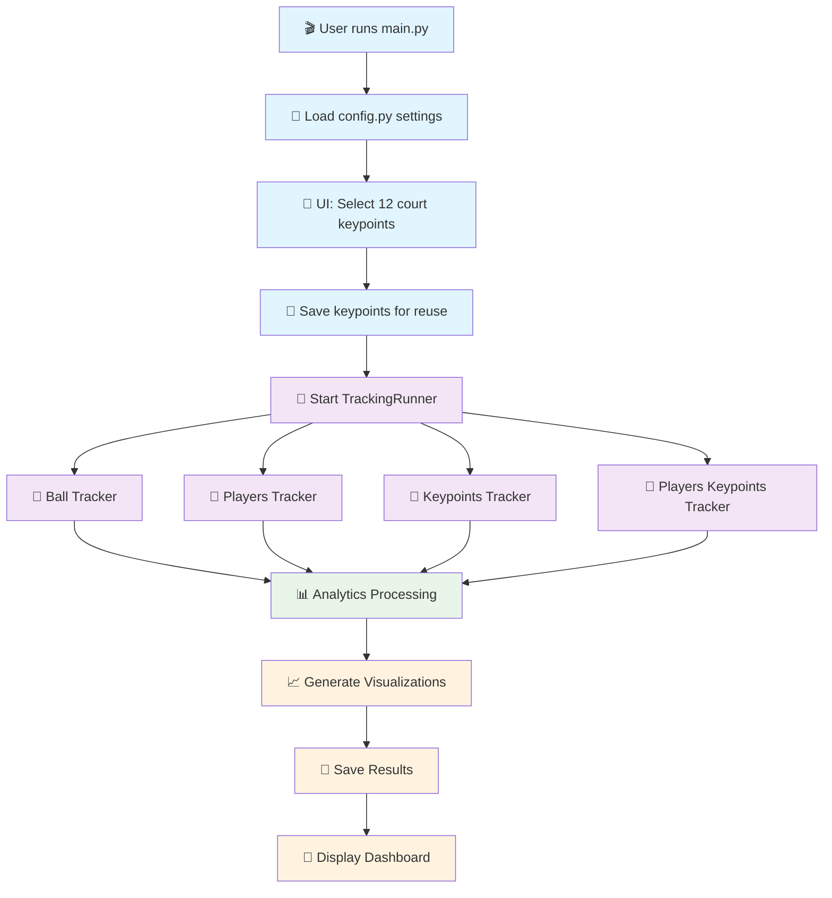
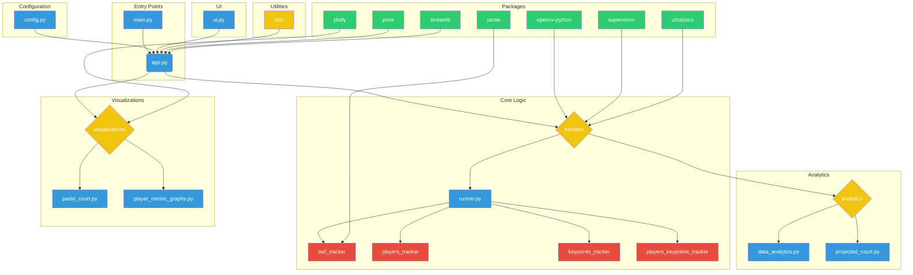

# Architecture Overview

Welcome to the Padel Analytics architecture guide! This document will help you understand how all the pieces of this computer vision system work together.

## 🎯 What You'll Learn

- How data flows through the system
- The role of each major component
- How different modules interact with each other
- Key design patterns used throughout the project

## 📋 Prerequisites

Before diving into the architecture, make sure you understand:

- **Python basics**: Classes, functions, modules, and imports
- **Object-oriented programming**: Inheritance and composition
- **Computer vision concepts**: What object detection and tracking mean
- **Video processing**: Understanding frames, fps, and video formats

## 🏗️ High-Level Architecture

Think of this system as a **pipeline** - like a factory assembly line where each station performs a specific task:

```none
Video Input → Court Setup → Object Tracking → Data Analysis → Visualizations
     ↓            ↓              ↓              ↓              ↓
   main.py    ui.py +        trackers/      analytics/   visualizations/
              config.py       runner.py
```

### 🔄 Data Flow Explained

Let's follow a video through the entire system:

1. **🎬 Input Stage** (`main.py` + `config.py`)
   - User provides a padel game video
   - System loads configuration settings (model paths, parameters)
   - **Think of this as**: Setting up your workspace before starting work

2. **🎯 Court Setup** (`ui.py`)
   - User manually selects 12 key points on the court
   - These points define the court's geometry for later calculations
   - **Think of this as**: Calibrating your measuring tools

3. **🔍 Object Tracking** (`trackers/runner.py`)
   - AI models detect and track ball, players, and court features
   - Processes video frame by frame for consistency
   - **Think of this as**: Following moving objects with your eyes

4. **📊 Data Analysis** (`analytics/`)
   - Raw tracking data becomes meaningful metrics
   - Calculates speeds, distances, heatmaps, etc.
   - **Think of this as**: Turning observations into insights

5. **📈 Visualization** (`visualizations/`)
   - Creates graphs, charts, and visual overlays
   - Makes complex data easy to understand
   - **Think of this as**: Creating a presentation of your findingsure Overview

The project follows a modular architecture that begins with video input and ends with insightful visualizations. Here’s a simplified breakdown of how the components work together:

1. **Configuration and Input:** The process starts with `main.py`, which loads settings from `config.py`. The user then provides a video and selects key points on the court through the UI managed by `ui.py`.

2. **Tracking:** The `trackers/runner.py` script takes the video and key points as input and uses various models to track the ball and players frame by frame.

3. **Data Analysis:** The tracking data is passed to the `analytics/` modules, where it is transformed into meaningful metrics like player heatmaps and ball speed.

4. **Visualization:** Finally, the `visualizations/` scripts use the processed data to generate visual outputs, such as a 2D projection of the court and performance graphs, giving you a clear view of the game's dynamics.

## 🧩 Core Components Deep Dive

### 📂 Project Structure at a Glance

```none
padel_analytics/
├── 🚪 Entry Points
│   ├── main.py          # CLI interface with court setup
│   └── app.py           # Web dashboard (Streamlit)
├── ⚙️ Configuration
│   └── config.py        # All settings and parameters
├── 🖼️ User Interface
│   └── ui.py            # Court keypoint selection tool
├── 🎯 Core Tracking
│   └── trackers/
│       ├── runner.py           # Orchestrates all tracking
│       ├── ball_tracker/       # Detects and tracks ball
│       ├── players_tracker/    # Detects and tracks players
│       ├── keypoints_tracker/  # Detects court features
│       └── players_keypoints_tracker/  # Player pose estimation
├── 📊 Analytics
│   └── analytics/
│       ├── data_analytics.py   # Calculates metrics and stats
│       └── projected_court.py  # 3D to 2D court projection
├── 📈 Visualizations
│   └── visualizations/
│       ├── padel_court.py          # Court drawings and overlays
│       └── player_centric_graphs.py  # Performance charts
├── 🛠️ Utilities
│   └── utils/
│       ├── video.py        # Video processing helpers
│       └── conversions.py  # Data format converters
└── 📏 Constants
    └── constants/
        ├── court_dimensions.py  # Official court measurements
        └── player_heights.py   # Average player dimensions
```

### 🔑 Key Design Patterns

#### 1. **Tracker Abstraction Pattern**

All trackers inherit from a base `Tracker` class, ensuring consistency:

```python
# Every tracker follows this pattern
class BallTracker(Tracker):
    def predict_frame(self, frame):
        # Process single frame
        pass
    
    def predict_sample(self, video_sample):
        # Process multiple frames
        pass
    
    def serialize(self):
        # Save results to JSON
        pass
```

**Why this matters**: As a junior developer, you can add new trackers by following this same pattern!

#### 2. **Memory-Efficient Pipeline Pattern**

The system processes videos frame-by-frame instead of loading everything into memory:

```python
# Instead of loading entire video (❌ Memory intensive)
video_frames = load_entire_video()  # Could crash on large videos!

# We process frame by frame (✅ Memory efficient)
for frame in video_reader:
    results = tracker.predict_frame(frame)
    save_results(results)
```

#### 3. **Configuration-Driven Design**

All parameters are centralized in `config.py`:

```python
# Instead of hardcoded values scattered everywhere
BATCH_SIZE = 16  # ❌ Hard to change
MODEL_PATH = "/some/path"  # ❌ Hard to find

# We centralize configuration
# config.py
PLAYERS_TRACKER_BATCH_SIZE = 16  # ✅ Easy to adjust
PLAYERS_TRACKER_MODEL = "path/to/model"  # ✅ Easy to update
```

## 🔄 Execution Flow Diagram



## 🧠 Understanding the Tracker System

### How Multiple Trackers Work Together

Think of the tracking system like a **team of specialists**:

- **Ball Tracker**: Like a sports commentator focused only on the ball
- **Players Tracker**: Like a photographer following the athletes
- **Keypoints Tracker**: Like a surveyor measuring the court
- **Players Keypoints Tracker**: Like a motion capture specialist studying player poses

### Memory Management Strategy

```python
# The TrackingRunner is smart about memory usage:
class TrackingRunner:
    def run(self):
        for frame_number, frame in enumerate(video):
            # Process each tracker on the same frame
            ball_results = ball_tracker.predict_frame(frame)
            player_results = players_tracker.predict_frame(frame)
            
            # Immediately save results (don't accumulate in memory)
            self.save_frame_results(frame_number, ball_results, player_results)
            
            # Frame goes out of scope and gets garbage collected
```

**Why this matters**: Even with a 2-hour video (200,000+ frames), the system won't run out of memory!

## 🔗 Component Interactions

### Configuration Flow

```none
config.py → All Components
    ├── Model paths → Trackers
    ├── Batch sizes → GPU memory management
    ├── Cache paths → Result storage
    └── Video settings → Processing parameters
```

### Data Flow Between Components

```none
Raw Video
    ↓
Court Keypoints (UI selection)
    ↓
Tracking Data (JSON format)
    ↓
Analytics Data (Metrics & Statistics)
    ↓
Visualizations (Charts & Overlays)
```

## 🎓 For Junior Developers: Key Takeaways

1. **Modularity**: Each component has a single responsibility
2. **Abstraction**: Common interfaces make the system extensible
3. **Configuration**: Centralized settings make the system configurable
4. **Memory Efficiency**: Frame-by-frame processing handles large videos
5. **Data Pipeline**: Clear data transformations from input to output

## 🚀 Getting Started Tips

1. **Start with `main.py`**: This is your entry point
2. **Understand `config.py`**: This controls everything
3. **Study the base `Tracker` class**: This shows the pattern all trackers follow
4. **Follow the data**: Trace how a single frame flows through the system
5. **Use the visualizations**: They help you understand what each component produces

## Visual Diagram


