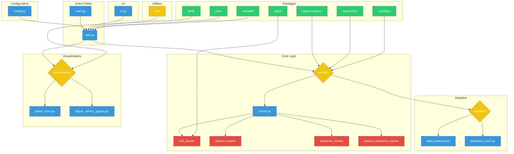

# Architecture Overview

The project follows a modular architecture that begins with video input and ends with insightful visualizations. Here’s a simplified breakdown of how the components work together:

1. **Configuration and Input:** The process starts with `main.py`, which loads settings from `config.py`. The user then provides a video and selects key points on the court through the UI managed by `ui.py`.

2. **Tracking:** The `trackers/runner.py` script takes the video and key points as input and uses various models to track the ball and players frame by frame.

3. **Data Analysis:** The tracking data is passed to the `analytics/` modules, where it is transformed into meaningful metrics like player heatmaps and ball speed.

4. **Visualization:** Finally, the `visualizations/` scripts use the processed data to generate visual outputs, such as a 2D projection of the court and performance graphs, giving you a clear view of the game's dynamics.

## Visual Diagram

